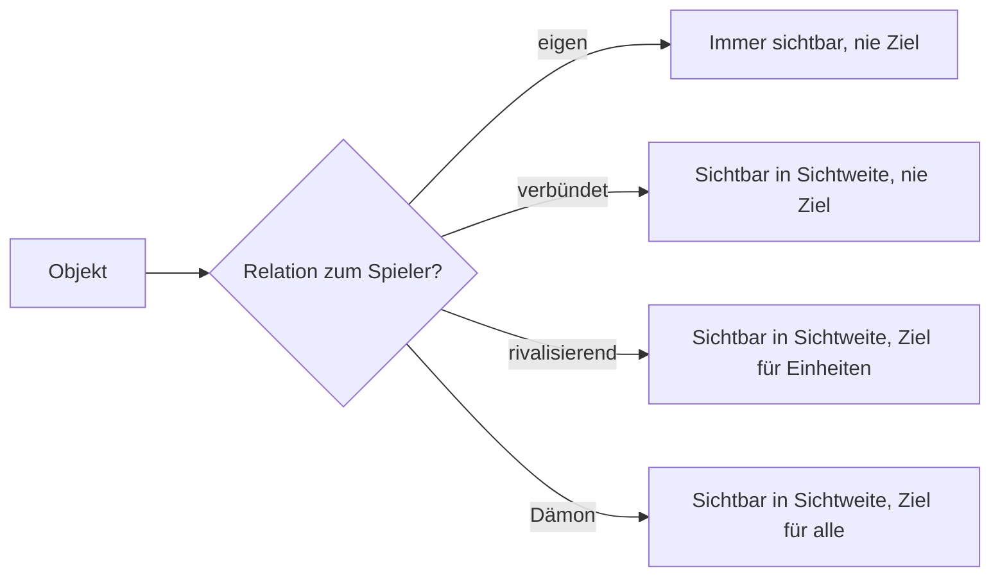

# 15. Spielbegriffe: Vokabular aus Game Design und Netcode

[← Grundlagen](README.md)

**Problem:** Das Game-Design-Dokument benutzt Wörter, die in der Spieleentwicklung feststehen, in Business-Anwendungen aber nichts oder etwas anderes bedeuten — `Aggro`, `Affix`, `Tier`, `Stance`, `Hysterese`. Wer sie nicht kennt, liest Regeln falsch.

**Analogie:** Fachvokabular einer Domäne, wie „Buchung", „Storno", „Valuta" in der Finanzwelt. Die Begriffe sind kurz, weil sie oft gebraucht werden; die Definition steht hier einmal.

## Kampf und Ziele

| Begriff | Bedeutung | Business-Gegenstück |
|---|---|---|
| DPS | *Damage per second* — Schaden pro Sekunde; die eine Zahl, die Angriffskraft beschreibt | Durchsatz pro Sekunde |
| Tick-Schaden | Schaden wird nicht pro Treffer, sondern pro Simulationsschritt verbucht: `DPS × Tick-Intervall` | Periodische Abrechnung statt Einzelbuchung |
| Engagement-Radius | Kreis um einen festen Punkt (die *Station*), in dem eine Einheit Gegner angreift; ausserhalb ignoriert sie alles | Zuständigkeitsbereich |
| Zielpriorität | Feste Rangfolge der Zieltypen; innerhalb eines Rangs das Nächste; bei Gleichstand die kleinste ID — damit Server und Client dasselbe erwarten | Deterministische Sortierreihenfolge |
| Aggro / Aggressor | Wer zuerst angreift, wird zum gültigen Ziel für die Gegenseite. Ohne diesen Zustand greift niemand einen Spieler-Avatar an | „Wer die Transaktion anstösst, trägt das Risiko" |
| Stance (Kampfhaltung) | Spielereinstellung, wen der Avatar automatisch angreift: nur Dämonen, oder alles Feindliche | Feature-Flag pro Benutzer |
| Knockout | Avatar auf 0 HP: für eine Abklingzeit weder angreifbar noch kampffähig; nichts geht verloren | Sperrfrist |
| Out of Combat | Zustand nach N Sekunden ohne Schaden; erst dann regeneriert etwas | Debounce |
| Welle (Wave) | Gruppe von Dämonen, die ein Hellgate im festen Takt ausstösst | Batch-Job auf Timer |
| Eskalation | Ein unbeachtetes Hellgate wird stufenweise stärker; Belohnung steigt mit | Eskalationsstufe im Incident-Management |

## Fortschritt und Beute

| Begriff | Bedeutung | Business-Gegenstück |
|---|---|---|
| Tier (Stufe) | Qualitäts- oder Technikstufe eines Gegenstands, einer Einheit oder eines Gates: T1, T2, T3. Höher = stärker, teurer, später | Produktklasse / Servicestufe |
| Level-Gate | Zugang zu einer Stufe ist an das Avatar-Level gebunden. *Hart*: gesperrt. *Weich*: erlaubt, aber teurer. Dieses Projekt: hart | Rollenbasierte Berechtigung |
| Rarity (Seltenheitsstufe) | Klasse eines Gegenstands (Common … Epic), die per gewichtetem Zufall bestimmt wird und die Anzahl Affixe festlegt | Gewichtete Verlosung |
| Affix | Zufällig gewählte Zusatzeigenschaft eines Gegenstands mit zufälligem Wert aus einem Bereich, z. B. „Schaden +12 %". Aus einem Pool, ohne Doppelung | Konfigurierbarer Zuschlag aus einer Preisliste |
| Roll | Der serverseitige Zufallsvorgang, der Rarity, Affixe und Werte bestimmt. Wird vor der Antwort an den Client festgeschrieben | Lotterie mit Audit-Log |
| Beuteanspruch (Kill Credit) | Wer den letzten Schaden gemacht hat, besitzt den Drop für ein Zeitfenster exklusiv; danach darf jeder | Reservierung mit Ablauf |
| Bound (gebunden) | Gegenstand ist an den Spieler gebunden: kein Handel, keine Übergabe | Nicht übertragbares Guthaben |
| Roster | Die Liste verfügbarer Einheitentypen einer Fraktion | Produktkatalog |
| Symmetrisch / asymmetrisch | Fraktionen mit gleichen Werten (nur andere Optik) vs. mit unterschiedlichen Stärken. Zum Start symmetrisch — Asymmetrie erst mit Daten | Mandanten mit gleicher / abweichender Konfiguration |

## Welt und Regeln

| Begriff | Bedeutung | Business-Gegenstück |
|---|---|---|
| Dichteklasse | Einteilung jeder H3-Zelle nach Gebäuden pro km² in drei Klassen (City, Suburb, Rural). Sichtweite, Einheitentempo, Besitzobergrenze und Interest-Radius hängen an der Klasse; das Einkommen an einer stetigen Formel | Preiszone / Tarifgebiet |
| Hysterese | Ein- und Ausschalten mit **verschiedenen** Schwellen oder Zeitfenstern, damit ein Wert an der Grenze nicht flackert. Beispiel Speed-Lock: sperren ab 30 km/h nach 20 s, freigeben unter 20 km/h nach 30 s | Thermostat; Alarm mit Entprellung |
| Hold-to-Conquer | Eroberung dauert N Sekunden; Präsenz wird am Anfang und am Ende geprüft | Zwei-Phasen-Bestätigung |
| Off-Road-Segment | Letztes Stück eines Weges abseits des Strassennetzes, per Luftlinie, längenbegrenzt. Ziel weiter weg → unerreichbar | Letzte Meile |
| Safe Zone | Kreis um einen Ort, in dem keine feindliche Handlung aufgelöst wird; Zugehörigkeit eines Gebäudes über seinen Mittelpunkt (Centroid) | Sperrbereich |
| Relation | Verhältnis jedes Objekts zum betrachtenden Spieler: eigen, verbündet, rivalisierend, Dämon. Jede Regel („feindlich") ist über die Relation definiert | Mandanten- / Rollenmatrix |
| Fog of War | Fremde Objekte sind nur in Sichtweite eigener Objekte sichtbar; der Server sendet Unsichtbares gar nicht | Zeilenbasierte Berechtigung, serverseitig gefiltert |

**Fallstricke**

| Fehler | Folge |
|---|---|
| Zielwahl ohne deterministischen Tie-Break | Client zeigt einen anderen Angriff als der Server rechnet |
| Avatar greift automatisch alles an | Spaziergang durch fremdes Gebiet startet ungewollt einen Krieg; darum Stance + Aggressor-Regel |
| Schwelle ohne Hysterese | Speed-Lock schaltet an jeder Ampel um |
| Zufall auf dem Client | Roll ist manipulierbar; deshalb serverseitig und vor der Antwort festgeschrieben |
| Beute ohne Anspruchsfenster | Fremde sammeln die Drops des Kämpfenden ein, bevor er hinkommt |
| Klassen ohne Hysterese an der Dichtegrenze | Zelle wechselt bei jeder Datenversion die Klasse; Werte springen — Klassen deshalb pro Datenversion fixiert |

**Im Projekt:** Die Regeln zu jedem Begriff stehen im Game Design — [Combat](../design/combat.md#combat), [RTS § Target Order](../design/rts.md#target-order), [RPG § Roll Model](../design/rpg.md#roll-model), [Factions § Relations](../design/factions.md#relations), [World § Density Classes](../design/world.md#density-classes). Werte: [Balance Parameters](../design/balance.md#balance-parameters).

---
