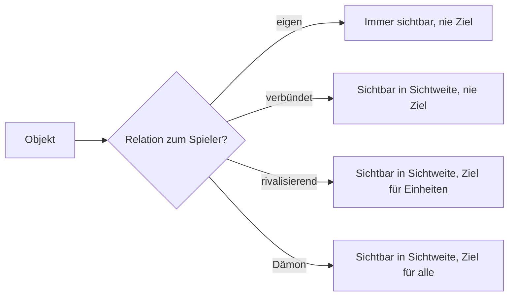
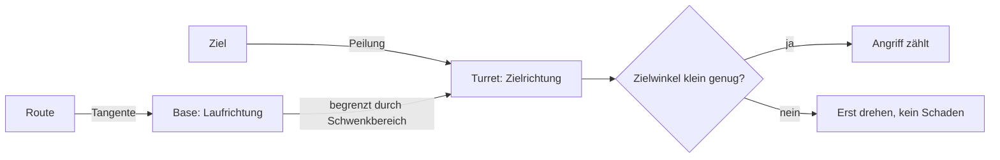
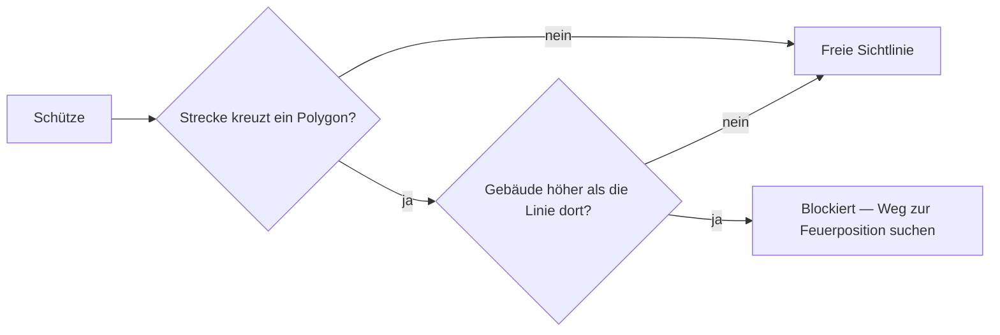

# 15. Spielbegriffe: Vokabular aus Game Design und Netcode

[← Grundlagen](README.md)

**Problem:** Das Game-Design-Dokument benutzt Wörter, die in der Spieleentwicklung feststehen, in Business-Anwendungen aber nichts oder etwas anderes bedeuten — `Aggro`, `Affix`, `Tier`, `Stance`, `Hysterese`. Wer sie nicht kennt, liest Regeln falsch.

**Analogie:** Fachvokabular einer Domäne, wie „Buchung", „Storno", „Valuta" in der Finanzwelt. Die Begriffe sind kurz, weil sie oft gebraucht werden; die Definition steht hier einmal.

## Kampf und Ziele

| Begriff | Bedeutung | Business-Gegenstück |
|---|---|---|
| DPS | *Damage per second* — Schaden pro Sekunde; die eine Zahl, die Angriffskraft beschreibt | Durchsatz pro Sekunde |
| Tick-Schaden | Schaden wird nicht pro Treffer, sondern pro Simulationsschritt verbucht: `DPS × Tick-Intervall` | Periodische Abrechnung statt Einzelbuchung |
| Engagement-Radius | Kreis um einen festen Punkt (die *Station*), in dem eine Einheit Gegner angreift; ausserhalb ignoriert sie alles | Zuständigkeitsbereich |
| Zielwahl (Target Order) | Regel, welches Ziel ein automatischer Angreifer nimmt. Hier **ohne Rangfolge nach Typ**: ein gültiger feindlicher Avatar zuerst, sonst das Nächste; bei Gleichstand die kleinste ID | Deterministische Sortierreihenfolge |
| Zielauswahl durch den Spieler | Der eigene Avatar bekommt sein Ziel per Tipp; alles andere zielt automatisch | Manuelle Zuweisung statt Regelwerk |
| Aggro / Aggressor | Wer zuerst angreift, wird zum gültigen Ziel für die Gegenseite. Ohne diesen Zustand greift niemand einen Spieler-Avatar an | „Wer die Transaktion anstösst, trägt das Risiko" |
| Stance (Kampfhaltung) | Spielereinstellung, wen der Avatar automatisch angreift: nur Dämonen, oder alles Feindliche | Feature-Flag pro Benutzer |
| Ghost (Geist) | Avatar auf 0 HP: bleibt sichtbar und beweglich, kann aber nichts mehr tun, was Anwesenheit braucht — und niemand kann ihn angreifen. Kein Timer | Gesperrtes Konto, das nur vor Ort entsperrt wird |
| Respawnpunkt | Selbst gesetzter Ort, an dem ein Ghost wieder lebendig wird; nur alle 48 h verschiebbar | Hinterlegte Zustelladresse mit Änderungssperre |
| Out of Combat | Zustand nach N Sekunden ohne Schaden; erst dann regeneriert etwas | Debounce |
| Welle (Wave) | Gruppe von Dämonen, die ein Hellgate im festen Takt ausstösst | Batch-Job auf Timer |
| Eskalation | Ein unbeachtetes Hellgate wird stufenweise stärker; Belohnung steigt mit | Eskalationsstufe im Incident-Management |

## Fortschritt und Beute

| Begriff | Bedeutung | Business-Gegenstück |
|---|---|---|
| Tier (Stufe) | Qualitäts- oder Technikstufe eines Gegenstands, einer Einheit oder eines Gates: T1, T2, T3. Höher = stärker, teurer, später | Produktklasse / Servicestufe |
| Level-Gate | Zugang zu einer Stufe ist an das Avatar-Level gebunden. *Hart*: gesperrt. *Weich*: erlaubt, aber teurer. Dieses Projekt: hart | Rollenbasierte Berechtigung |
| Rarity (Seltenheitsstufe) | Klasse eines Gegenstands (Common … Epic), die per gewichtetem Zufall bestimmt wird und die Anzahl Affixe festlegt | Gewichtete Verlosung |
| Affix | Zufällig gewählte Zusatzeigenschaft eines Gegenstands mit zufälligem Wert aus einem Bereich, z. B. „Schaden +12 %". Aus einem Pool, ohne Doppelung | Konfigurierbarer Zuschlag aus einer Preisliste |
| Roll | Der serverseitige Zufallsvorgang, der Rarity, Affixe und Werte bestimmt. Wird vor der Antwort an den Client festgeschrieben | Lotterie mit Audit-Log |
| Beuteanspruch (Kill Credit) | Wer den letzten Schaden gemacht hat, besitzt den Drop für ein Zeitfenster exklusiv; danach darf jeder | Reservierung mit Ablauf |
| Bound (gebunden) | Gegenstand ist an den Spieler gebunden: kein Handel, keine Übergabe | Nicht übertragbares Guthaben |
| Roster | Die Liste verfügbarer Einheitentypen einer Fraktion | Produktkatalog |
| Symmetrisch / asymmetrisch | Fraktionen mit gleichen Werten (nur andere Optik) vs. mit unterschiedlichen Stärken. Zum Start symmetrisch — Asymmetrie erst mit Daten | Mandanten mit gleicher / abweichender Konfiguration |

## Welt und Regeln

| Begriff | Bedeutung | Business-Gegenstück |
|---|---|---|
| Dichteklasse | Einteilung jeder H3-Zelle nach Gebäuden pro km² in drei Klassen (City, Suburb, Rural). Sichtweite, Einheitentempo, Besitzobergrenze und Interest-Radius hängen an der Klasse; das Einkommen an einer stetigen Formel | Preiszone / Tarifgebiet |
| Hysterese | Ein- und Ausschalten mit **verschiedenen** Schwellen oder Zeitfenstern, damit ein Wert an der Grenze nicht flackert. Beispiel Speed-Lock: sperren ab 30 km/h nach 20 s, freigeben unter 20 km/h nach 30 s | Thermostat; Alarm mit Entprellung |
| Hold-to-Conquer | Eroberung dauert N Sekunden; Präsenz wird am Anfang und am Ende geprüft | Zwei-Phasen-Bestätigung |
| Off-Road-Segment | Letztes Stück eines Weges abseits des Strassennetzes, per Luftlinie, längenbegrenzt. Ziel weiter weg → unerreichbar | Letzte Meile |
| Safe Zone | Kreis um einen Ort, in dem keine feindliche Handlung aufgelöst wird; Zugehörigkeit eines Gebäudes über seinen Mittelpunkt (Centroid) | Sperrbereich |
| Relation | Verhältnis jedes Objekts zum betrachtenden Spieler: eigen, verbündet, rivalisierend, Dämon. Jede Regel („feindlich") ist über die Relation definiert | Mandanten- / Rollenmatrix |
| Fog of War | Fremde Objekte sind nur in Sichtweite eigener Objekte sichtbar; der Server sendet Unsichtbares gar nicht | Zeilenbasierte Berechtigung, serverseitig gefiltert |

## Ausrichtung und Drehung

Eine Figur hat zwei Richtungen: wohin sie läuft und wohin sie zielt. Ob beide auseinanderlaufen dürfen, ist eine **Spielregel**, kein Animationsdetail — sie entscheidet, ob eine Einheit im Rückwärtslaufen schiessen kann.

| Begriff | Bedeutung | Business-Gegenstück |
|---|---|---|
| Yaw (Gierwinkel) | Drehung um die Hochachse. In einer Karten-Draufsicht die einzige Drehachse, die man sieht | Die eine Dimension, die zählt |
| Heading | Bewegungsrichtung, aus zwei Positionen abgeleitet | Trend aus zwei Messpunkten |
| Facing | Ausrichtung eines Objekts, unabhängig davon, wohin es sich bewegt | Gespeicherter Zustand statt Ableitung |
| Base (Unterkörper, Fahrwerk) | Der Teil, der dem Weg folgt | — |
| Turret (Oberkörper, Waffenaufbau) | Der Teil, der dem Ziel folgt | — |
| Schwenkbereich (Traverse Arc) | Wie weit der Oberkörper gegen den Unterkörper verdreht werden darf, z. B. ± 45° | Erlaubter Abweichungsbereich |
| Drehrate (Turn Rate) | Zulässige Winkeländerung pro Sekunde; je kleiner, desto träger das Objekt | Durchsatzgrenze |
| Feuerbogen (Fire Gate) | Ein Angriff zählt nur, solange der Zielwinkel klein genug ist | Vorbedingung vor der Buchung |
| Tangente der Route | Richtung des Weges an der Stelle, an der das Objekt gerade steht | Ableitung einer Kurve |
| Abgeleiteter Zustand | Wert, den beide Seiten aus vorhandenen Daten berechnen, statt ihn zu übertragen | Berechnetes Feld statt gespeicherter Spalte |

Zwei Bauarten, ein Modell: ein Panzer hat vollen Schwenkbereich und dreht langsam, eine Fussfigur hat einen engen Bereich und dreht schnell. Drehen kostet **Zeit**, nicht eine Abklingzeit.

## Sichtlinie und indirektes Feuer

Zwei Wege, wie ein Schuss sein Ziel erreicht — und der Unterschied ist eine Spielregel, keine Grafik.

| Begriff | Bedeutung | Business-Gegenstück |
|---|---|---|
| Sichtlinie (Line of Sight, LOS) | Gerade zwischen Schütze und Ziel. Liegt ein Gebäude im Weg, kommt der Schuss nicht an | Vorbedingung, die den Vorgang abbricht |
| Direktes Feuer | Waffe braucht eine freie Sichtlinie; trifft sofort | Synchroner Aufruf: geht durch oder nicht |
| Indirektes Feuer | Waffe schiesst im Bogen darüber hinweg; braucht keine Sichtlinie | Asynchroner Auftrag mit Laufzeit |
| Flugzeit | Zeit zwischen Abschuss und Einschlag, aus der Distanz berechnet | Verzögerte Ausführung, eingeplant beim Absenden |
| Zielpunkt (Aim Point) | Der **Ort**, auf den gefeuert wird — festgelegt beim Abschuss, nie nachgeführt | Momentaufnahme eines Werts zum Zeitpunkt der Buchung |
| Einschlagradius | Umkreis um den Zielpunkt, in dem der Schaden wirkt | Toleranzbereich |
| Feuerposition (Firing Solution) | Der erste Punkt auf dem Weg, von dem aus geschossen werden **kann** | Vorberechnetes Zwischenergebnis statt Ausprobieren pro Schritt |
| Deckung | Gebäude, das eine Sichtlinie blockiert — ohne eigene Regel, allein durch Geometrie | Nebenwirkung der Datenlage, nicht der Konfiguration |
| Spotter (Aufklärer) | Einheit, die für eine weiter hinten stehende Waffe sieht | Delegierte Leseberechtigung |

**2.5D statt 3D.** Die Welt besteht aus Grundrissen mit einer Höhe. Ob ein Gebäude blockiert, ist deshalb eine Rechnung, kein Raytracing: Schneidet die Strecke das Polygon, und liegt die Gebäudehöhe **über** der Sichtlinie an dieser Stelle? Ein Turm auf einem 20-m-Dach schiesst so über die Garage nebenan, eine Einheit am Boden nicht — dieselbe Formel, verschiedene Augenhöhen.

**Verzögerung ohne Zufall.** Indirektes Feuer trifft einen Ort, kein Objekt. Wer weggeht, bevor der Einschlag kommt, nimmt keinen Schaden — das ist **kein Würfeln**, sondern ein vorhersagbarer, ausspielbarer Ablauf. Der Unterschied ist wichtig: Zufall lässt sich nicht kontern, Timing schon.

**Fallstricke**

| Fehler | Folge |
|---|---|
| Zielwahl ohne deterministischen Tie-Break | Client zeigt einen anderen Angriff als der Server rechnet |
| Rangfolge nach Zieltyp als selbstverständlich annehmen | In diesem Projekt gibt es keine — nur „Avatar zuerst", danach entscheidet die Distanz |
| Respawnpunkt wie eine normale Entität streamen | Das ist in der Regel die Wohnadresse des Spielers; sie darf nie in fremden Daten auftauchen |
| Avatar greift automatisch alles an | Spaziergang durch fremdes Gebiet startet ungewollt einen Krieg; darum Stance + Aggressor-Regel |
| Schwelle ohne Hysterese | Speed-Lock schaltet an jeder Ampel um |
| Zufall auf dem Client | Roll ist manipulierbar; deshalb serverseitig und vor der Antwort festgeschrieben |
| Beute ohne Anspruchsfenster | Fremde sammeln die Drops des Kämpfenden ein, bevor er hinkommt |
| Klassen ohne Hysterese an der Dichtegrenze | Zelle wechselt bei jeder Datenversion die Klasse; Werte springen — Klassen deshalb pro Datenversion fixiert |
| Zielwahl nach dem kleinsten Drehwinkel statt nach der Prioritätsliste | Einheiten wechseln das Ziel, sobald sie sich drehen; Server und Client erwarten Verschiedenes |
| Drehung nur als Animation, ohne Regel dahinter | "Kann nicht rückwärts schiessen" ist reine Kosmetik und im Client abschaltbar |
| Winkelgrenze ohne Toleranz | Das Objekt pendelt am Rand des Schwenkbereichs, statt zu schiessen |
| Kürzesten Drehweg nicht über die 0°/360°-Grenze rechnen | Das Objekt dreht die lange Runde herum |
| Sichtlinie pro Tick für jedes Paar prüfen | Dauerlast für eine Antwort, die sich kaum ändert |
| Sichtlinie ohne Zeitpuffer an einer Hausecke | Einheit pendelt zwischen Schiessen und Laufen |
| Nicht eroberbare Gebäude aus der Geometrie weglassen | Einheiten schiessen durch sichtbare Häuser |
| Indirektes Feuer dem Ziel nachführen | Aus einer ausspielbaren Verzögerung wird ein garantierter Treffer |

**Im Projekt:** Die Regeln zu jedem Begriff stehen im Game Design — [Combat](../design/combat.md#combat), [RTS § Target Order](../design/rts.md#target-order), [RPG § Roll Model](../design/rpg.md#roll-model), [Factions § Relations](../design/factions.md#relations), [World § Density Classes](../design/world.md#density-classes), [Facing & Rotation](../design/facing.md#facing--rotation). Werte: [Balance Parameters](../design/balance.md#balance-parameters). Technische Umsetzung der Ausrichtung: [Architecture § Rotation & Facing](../architecture/rotation.md#rotation--facing).

---
