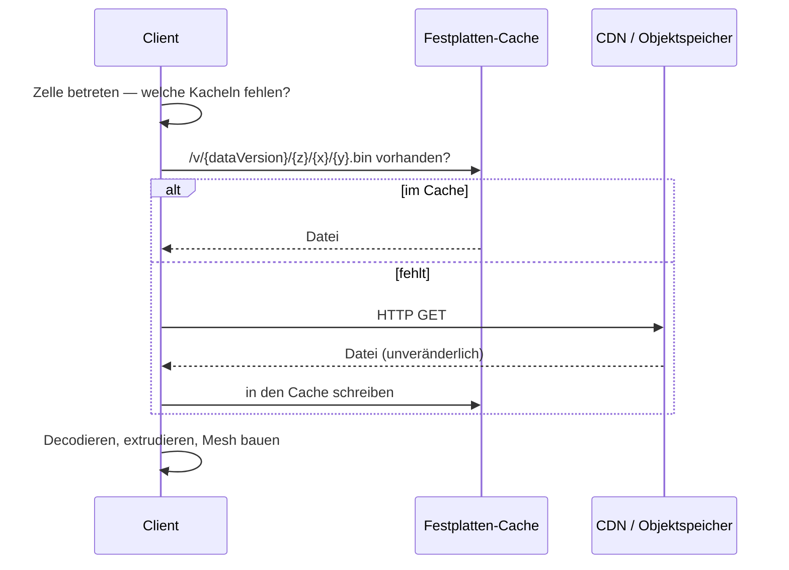
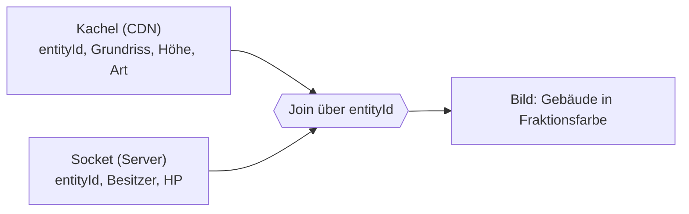
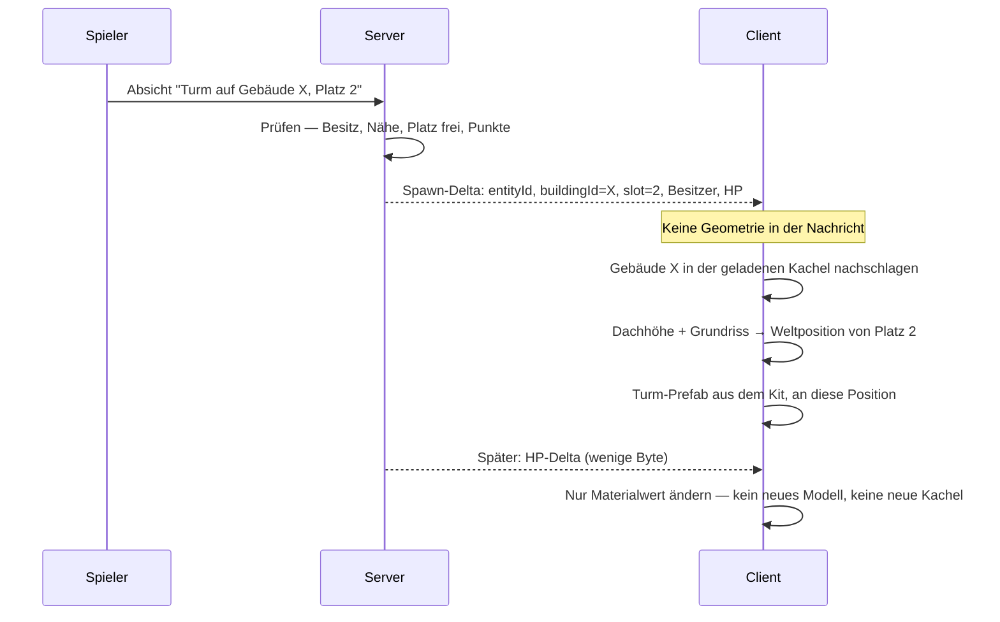

# 16. Statische Karte und lebender Zustand

[← Grundlagen](README.md)

**Problem:** Die Karte ist riesig und ändert sich fast nie. Der Spielzustand ist winzig und ändert sich ständig. Im Bild müssen beide zusammenkommen — ein Turm steht auf einem Dach, das aus einer Datei stammt, die Monate alt ist.

**Analogie:** Produktkatalog und Warenkorb. Der Katalog liegt versioniert auf dem CDN, für alle identisch, monatelang gecacht. Der Warenkorb kommt pro Benutzer aus der Anwendung und ändert sich bei jedem Klick. Die Seite zeigt beides zusammen, verbunden über die **Artikelnummer** — ausgeliefert werden sie über völlig getrennte Wege.

## Wie eine Kachel beim Spieler ankommt

Es gibt **keinen Kachelserver**. Eine Kachel ist eine Datei.

| Eigenschaft | Folge |
|---|---|
| Unveränderlich pro Datenversion | Cache darf unbegrenzt behalten; eine Änderung ist ein **neuer Pfad**, nie eine Bearbeitung |
| Für jeden Spieler identisch | Keine Berechnung pro Anfrage, keine Filterung, keine Autorisierung |
| Enthält keinen Spielerzustand | Öffentlicher Lesezugriff genügt als ganzes Zugriffsmodell |
| Grössenordnung | 10–100 KB pro Stadtkachel, **einmal** pro Datenversion — danach von der Platte |

Gegenrechnung: ein Zustands-Delta ist 8–24 Byte und kommt bei jeder Änderung. Die beiden Zahlen gehören zu verschiedenen Problemen — deshalb zwei Ebenen.

## Der Join: die Entity-ID

Die Kachel liefert **Geometrie**. Der Socket liefert **Zustand**. Verbunden werden sie über eine ID, die beide Seiten kennen — abgeleitet aus der Quelldatenbank (Overture GERS / OSM), nicht vergeben vom Renderer.

- Die Kachel weiss nichts vom Spiel. Der Zustand weiss nichts von Geometrie.
- Genau deshalb kann die Kachel für alle gleich bleiben, obwohl jeder Spieler etwas anderes sieht.
- Ein Renderer-SDK mit **eigenen** IDs kann diesen Join nicht — der Server könnte seine Objekte nicht benennen. Das ist der Grund für eigene Kacheln.

## Vier Sorten von Objekten

Woher Geometrie, Position und Zustand kommen, unterscheidet sich pro Sorte:

| Sorte | Beispiel | Geometrie | Position | Zustand |
|---|---|---|---|---|
| Statisch verankert | Gebäude, Strasse, Werkstatt | Kachel | Kachel | Socket (nur Gebäude: Besitzer, HP) |
| **Platziert** | **Turm, Fabrik** | Lokales Modell-Kit | Turm: Gebäude-ID + Dachplatz · Fabrik: eigene Koordinate | Socket |
| Beweglich | Einheit, Dämon, Avatar | Lokales Modell-Kit | Route + Serverzeit (Kapitel [7](07-streaming.md#bewegung-übertragen-positionsstrom-vs-route--fortschritt)) | Socket |
| Ereignis | Hellgate, Ground Drop | Lokales Modell-Kit | eigene Koordinate | Socket |

Nur die erste Sorte steht in der Kachel. Alles andere ist **Kit + Zustand**: das Modell liegt im installierten Spiel, über die Leitung kommt nur, *dass* es existiert, *wo* und *wie es ihm geht*.

## Beispiel: ein Spieler platziert einen Turm

Der Turm landet **nie** in einer Kachel. Was passierte, wenn doch:

| Turm in der Kachel | Folge |
|---|---|
| Kachel wäre pro Spieler verschieden | CDN-Cache wertlos, Kosten steigen mit Spielerzahl |
| Kachel müsste bei jeder Platzierung neu gebaut werden | Batch-Job landet im Request-Pfad |
| Fog of War wäre umgehbar | Wer die Datei lädt, sieht alles — auch Ungesehenes |
| Kachel-Version würde ständig wechseln | Clients laden dauernd neu, Offline-Betrieb fällt aus |

## Reihenfolge: beide Ebenen kommen unabhängig an

Kachel und Zustand haben keinen gemeinsamen Transport und keine gemeinsame Reihenfolge.

| Fall | Regel |
|---|---|
| Zustand da, Geometrie fehlt noch | Zustand halten, **nicht** zeichnen — sonst schwebt der Turm auf Höhe 0 |
| Geometrie da, Zustand fehlt noch | Neutral zeichnen: Gebäude ohne Besitzerfarbe |
| Beides da | Join, zeichnen |
| Neue Datenversion, `entityId` verschwunden | Zustand umhängen oder freigeben — die Regel steht in [Data Refresh](../architecture/map-data.md#data-refresh) |

**Fallstricke**

| Fehler | Folge |
|---|---|
| Spielzustand in die Kachel schreiben | Kachel wird pro Spieler verschieden — Cache und Kostenmodell sind hin |
| Entity-ID aus dem Kachel-Index ableiten | Eine neue Datenversion verschiebt Indizes; Besitz landet am falschen Haus |
| Zustand zeichnen, bevor die Geometrie geladen ist | Türme schweben oder versinken |
| Kachelpfad ohne Datenversion | Halb aktualisierte Welt, nicht reproduzierbare Fehler |
| Live-Objekte in den Kachel-Cache schreiben | Nach Reconnect wird veralteter Zustand gezeigt |
| Platzierte Objekte als Geometrie übertragen | Bytes pro Tick für ein Modell, das längst installiert ist |
| Annehmen, Kachel und Delta träfen zusammen ein | Race beim Betreten einer Zelle |

**Im Projekt:** → [Architecture § Two Delivery Planes](../architecture/README.md#two-delivery-planes), [§ Delivery: No Tile Server](../architecture/map-data.md#delivery-no-tile-server), [§ Tile Payload](../architecture/map-data.md#tile-payload), [§ Entity Classes](../architecture/streaming.md#entity-classes), [§ Building Tint](../architecture/client.md#building-tint). Welche Objekte es überhaupt gibt, entscheidet [Game Design § Entities](../design/entities.md#entities).

---
